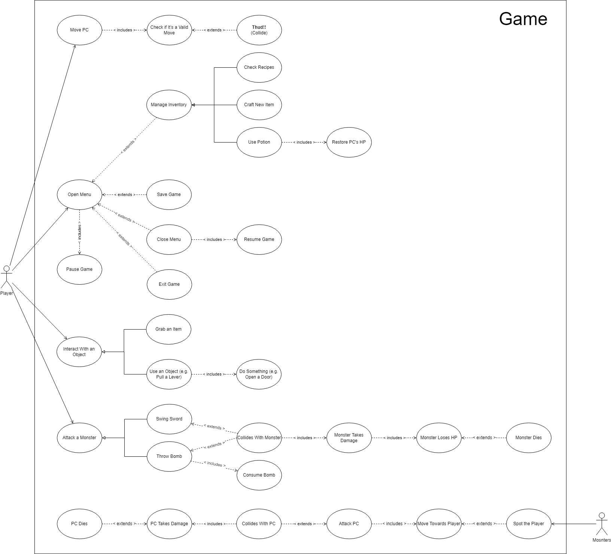

# Documentação

## Fluxo Principal do Jogo

O diagrama abaixo compõe o fluxo das principais ações do jogo.

Para detalhes mais específicos de cada caso de uso, eles podem ser encontrados em [`use-cases/`](use-cases/), onde cada subpasta possui um arquivo `README.md` próprio, contendo um **diagrama de caso de uso** e suas **especificações**.
