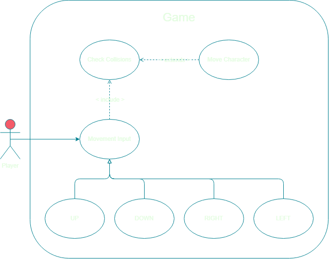

# Movimento do Personagem Jogável

## Descrição

Com o teclado, o jogador tenta mover seu personagem por uma superfície 2D. O sistema verifica como prosseguir, podendo deslocar o personagem do jogador ou fazê-lo colidir com um bloco sólido, fazê-lo sofrer dano ou até mesmo mata-lo.

## Atores

O único ator envolvido é o jogador, que realiza o papel de iniciador (ator primário).

## Pré-Condições

O jogador precisa pressionar uma tecla reconhecida pelo jogo.

## Pós-Condições

O personagem do jogador é deslocado para a posição desejada.

## Fluxo Completo

1. O jogador pressiona uma ou mais teclas: `W` (`UP`), `A` (`LEFT`), `S` (`DOWN`) e/ou `D` (`UP`).
2. O sistema verifica se não estão ocorrendo colisões com obstáculos, objetos ou inimigos.
   1. Caso ocorra colisão com uma parede, um obstáculo ou um objeto, o personagem do jogador não é deslocado e um som de colisão é reproduzido. Caso de uso encerrado.
   2. Caso ocorra colisão com um inimigo, o personagem do jogador sofre uma quantidade de dano.
      1. Caso o dano recebido seja maior do que a quantidade de pontos de vida remanescente, o personagem do jogador morre. Caso de uso encerrado.
      2. Caso o dano recebido seja menor do que a quantidade de pontos de vida remanescente, o personagem do jogador torna-se incapaz a receber dano novamente por um breve tempo. Caso de uso encerrado.
   3. Caso ocorra colisão com um buraco, o personagem do jogador morre instantaneamente. Caso de uso encerrado.
3. Caso não haja colisões, o personagem do jogador é deslocado para a posição desejada. Caso de uso encerrado.
